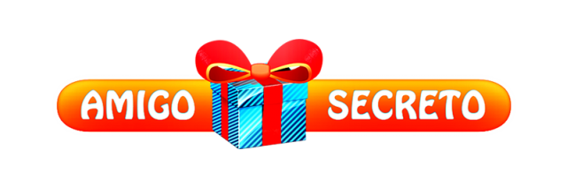
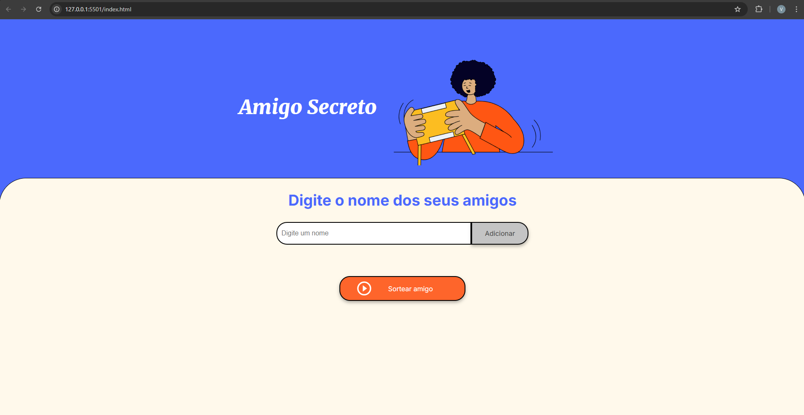

<div align="center">
  
</div>

Bem-vindo ao **Amigo Secreto**, um jogo interativo desenvolvido em HTML e JavaScript! 
Este projeto permite sortear amigos de forma divertida e intuitiva, e foi criado baseado no aprendizado oferecido pelo **Programa ONE - Oracle Next Education: GRUPO 8** 
em parceria com a **Alura**. Espero que aproveite bem!🥳

## 🚀 Funcionalidades
- Adicione nomes à lista de participantes
- Sorteie um amigo secreto aleatoriamente
- Interface amigável e fácil de usar

## 📸 Demonstração


## 📥 Como rodar o projeto
```bash
# Clone o repositório
git clone https://github.com/valteciodev/amigo-secreto.git

# Acesse a pasta do projeto
cd amigo-secreto

# Abra o arquivo index.html no navegador
```
Ou pode usar direto no navegador clicando [aqui](https://valteciodev.github.io/amigo-secreto/).

## 🛠 Tecnologias utilizadas
- HTML, CSS e JavaScript

## 📜 Licença
Este projeto está sob a licença MIT.

---
💡 Desenvolvido por [valtecio Silva Almeida](https://github.com/valteciodev)
